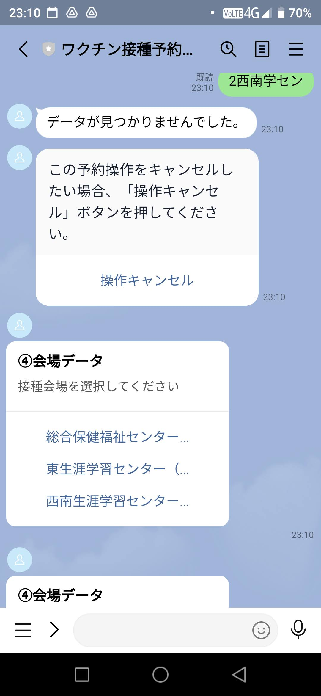
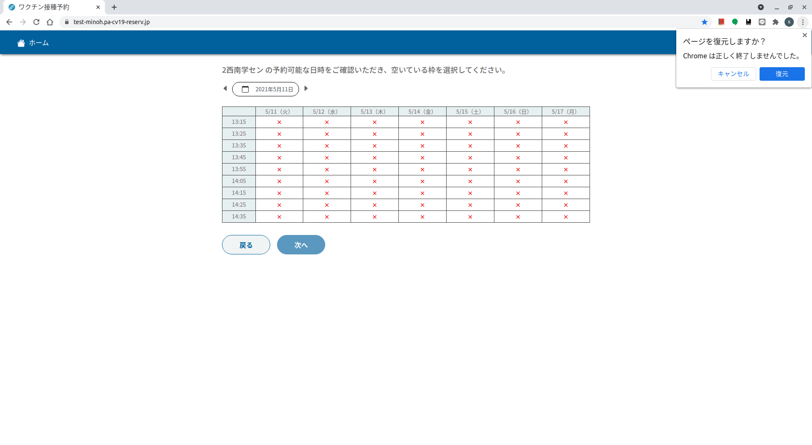
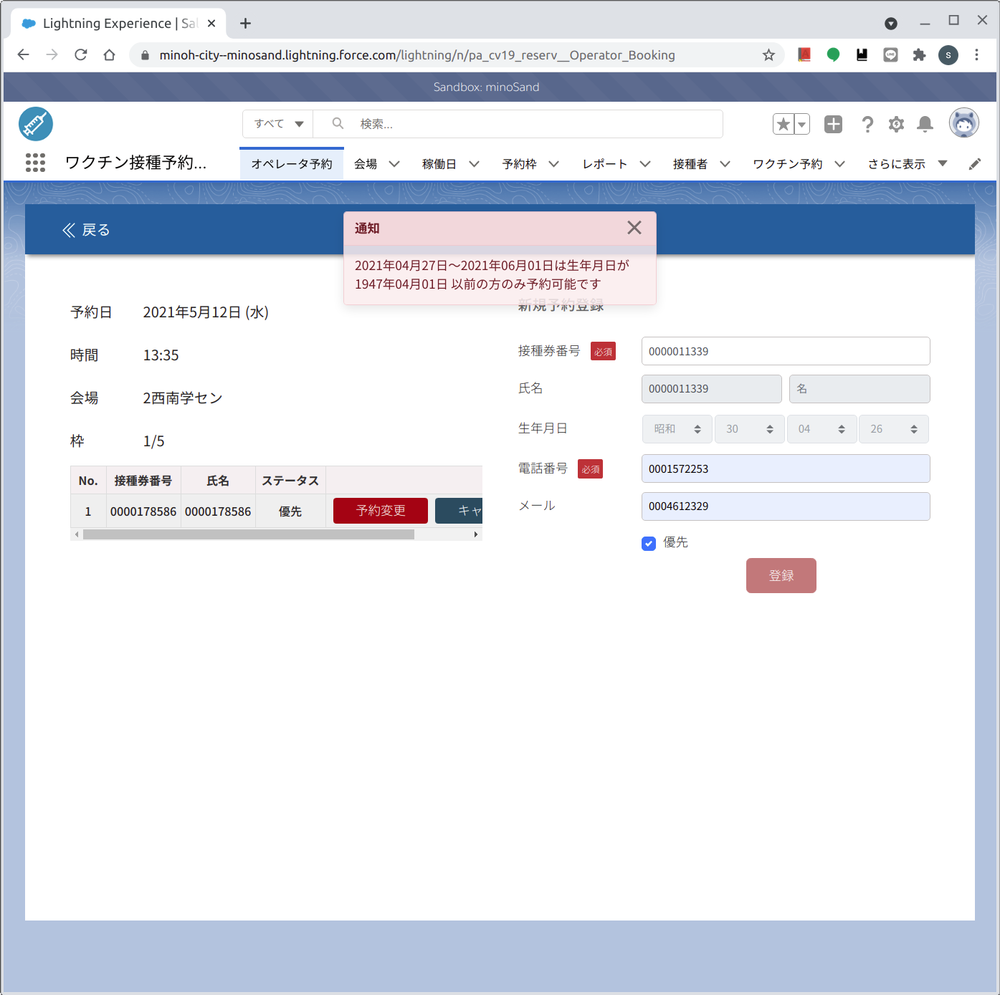

# 3. 制限機能
## [戻る](https://github.com/78tch/VaccineYoyaku)　[1.システム概要](https://github.com/78tch/VaccineYoyaku/blob/main/1About/1-1About.md)　→　[2.システムメッセージ文言](https://github.com/78tch/VaccineYoyaku/blob/main/2SystemMessage/2-0Messages.md)　→　3.制限機能　→　[4. 動作確認](https://github.com/78tch/VaccineYoyaku/blob/main/4Check/4-1Check.md) 　→　[5. コールセンター話法](https://github.com/78tch/VaccineYoyaku/blob/main/5CallCenter/5-1CallCenter.md)　→[6. 予約枠](https://github.com/78tch/VaccineYoyaku/blob/main/6Timetable/6-1Timetable.md)　→　[7. 設定切替](https://github.com/78tch/VaccineYoyaku/blob/main/7Operation/7-1Operation.md)  

## 3-1.排他制御  
誰かが「最後の１枠」を選択していても、まだ「確定」していなければ、ほかの人もその時点では選択はできてしまう。  
そして同時に「確定」しようとすると、たまたま一番最初に処理された人は予約がとれ、そのほかの人は
・LINE版では「予約が取れませんでした。はじめからやり直してください」  
・Web版では「予約が取れませんでした。戻って別の日時を選択してください」  
となります。

## 3-2.75歳以上のみ予約可（年度年齢制限）

1947年4月2日生まれを含みそれ以降の人が操作すると・・・  
手段 | 画面イメージ | 見え方  
----|----|----
 LINE版 |  | どの会場を選んでも「データが見つかりませんでした。」となる。 
 Web版 |  | どの会場を選んでも、すべて「×」（予約が満員の状態と同様）
 コールセンター版 |  | 「登録」を押すと「1947年4月1日以前の方のみ予約可能です。」とエラーになる。
 

## 3-3.満16歳以上のみ予約可（当日年齢制限）
実装済みですが未試験。  
１６歳制限はまだ先なので、今後テストします。  

## 3-4.前日当日キャンセル不可  
実装確認済み。  
おって画面イメージ掲載します。