# 5. コールセンター話法  
## [戻る](https://github.com/78tch/VaccineYoyaku)　[1.システム概要](https://github.com/78tch/VaccineYoyaku/blob/main/1About/1-1About.md)　→　[2.システムメッセージ文言](https://github.com/78tch/VaccineYoyaku/blob/main/2SystemMessage/2-0Messages.md)　→　[3.制限機能](https://github.com/78tch/VaccineYoyaku/blob/main/3Limit/3-1Limit.md)　→　[4. 動作確認](https://github.com/78tch/VaccineYoyaku/blob/main/4Check/4-1Check.md) 　→　5. コールセンター話法　→[6. 予約枠](https://github.com/78tch/VaccineYoyaku/blob/main/6Timetable/6-1Timetable.md)　→　[7. 設定切替](https://github.com/78tch/VaccineYoyaku/blob/main/7Operation/7-1Operation.md)  

## 5-1.新規予約時の話法  
 画面 | 画面イメージ | セリフ  
----|----|----
 画面１ |  | 事前にログインしておく。 
 前段 | あ | 「○○コールセンター○○です。新型コロナワクチンの集団接種のご予約でよろしいでしょうか。ありがとうございます。 まず確認ですが、今回、第１回でワクチンが非常に限られているため、７５歳以上のかたのみの受付となっております。失礼ですがお歳はおいくつのかたでしょうか。年度内到達が国の基準のため、昭和２２年４月１日生まれ以前のかたです。７５歳未満６５歳以上のかたは、第２回の○月○日からの受付となります。あしからずご了承くださいませ。 お手元に接種券はございますか。今回ご案内するワクチンはファイザー社製で、３週間後に２回目接種が必要です。ワクチンロスを防ぐため、このお電話で２回目接種も、まとめてご予約承りますので、よろしくお願いします。」
 画面２ | 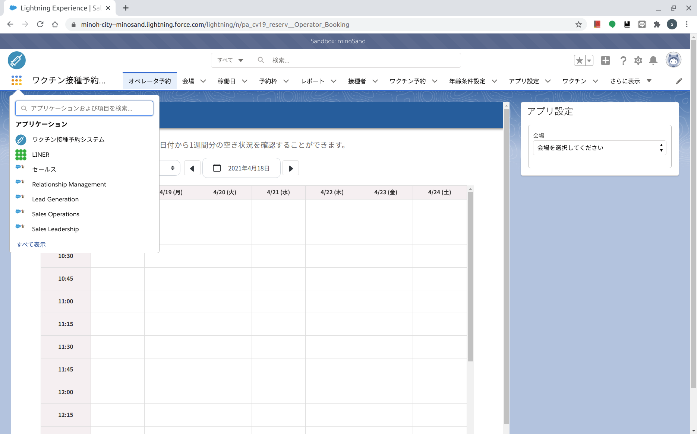  | まず、会場はどちらをご希望ですか。 お住まいはどちらでしょうか。 いまご案内できるのは○○センターのみとなっておりますが、よろしいでしょうか。 
 画面３ |   | つぎにお日取りですが、直近ですと○月○日と、その３週間後の○月○日の２回となりますが、いかがでしょうか。 午前、午後、どちらがよいでしょうか。 いつごろがよろしいでしょうか。 
 画面４ | 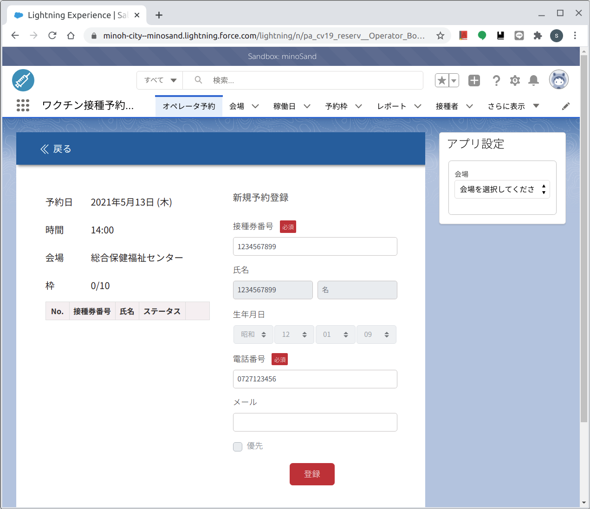  | おてもとの接種券の番号を教えてください。また、お名前、生年月日、それから念の為、日中に連絡のつくお電話番号を教えてください。 
 画面５ | 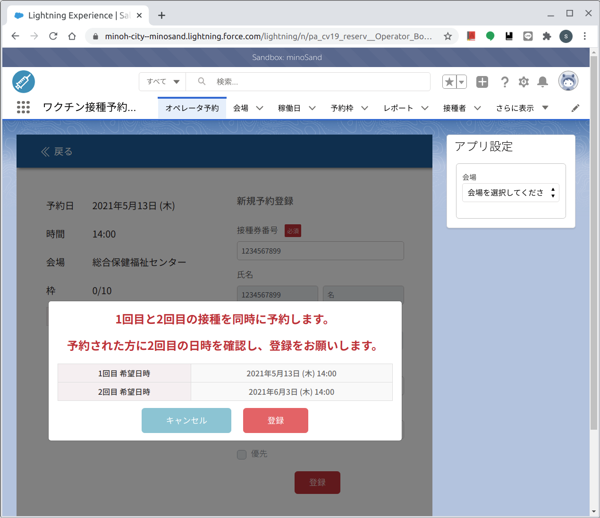  | それでは１回目接種を○月○日○時○分から、２回目接種をその３週間後の同じ曜日同じ時間の○月○日○時○分から、でご予約お取りしました。予約番号は、○番ですので、お問い合わせいただきます時には、接種券番号と併せてこの予約番号もおっしゃってください。   
 画面６ | 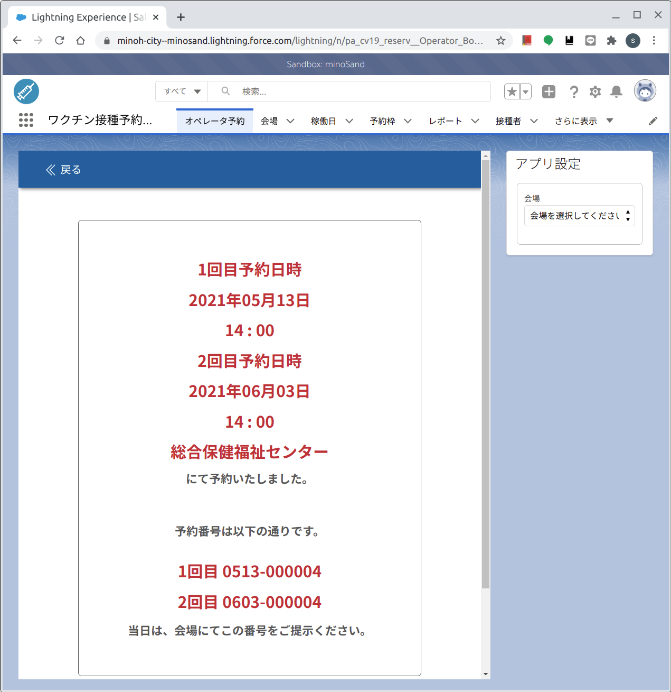  | ※この画面をキャプチャして欲しい（印刷できたら一番よいのですがプリンター不可？） 
 画面７ | 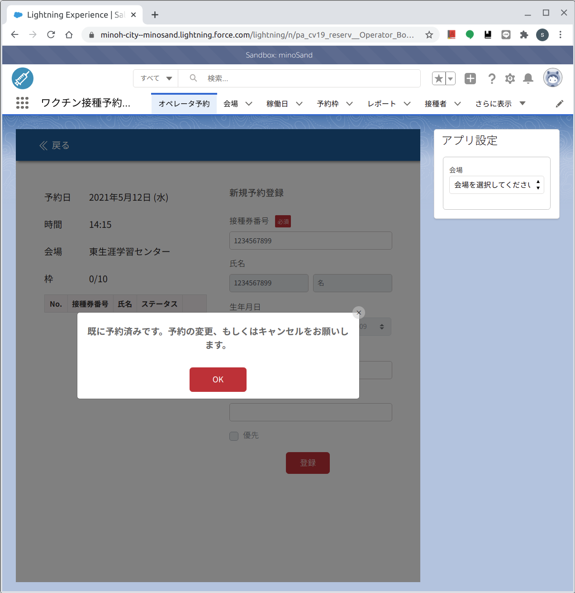  | おそれいります、いま見ましたら、すでにご予約がおありのようです。おこころあたりございませんでしょうか。  

## 5-2.予約変更時の話法  
 画面 | 画面イメージ | セリフ  
----|----|----
 画面１ |   | 事前にログインしておく  
 画面２ | 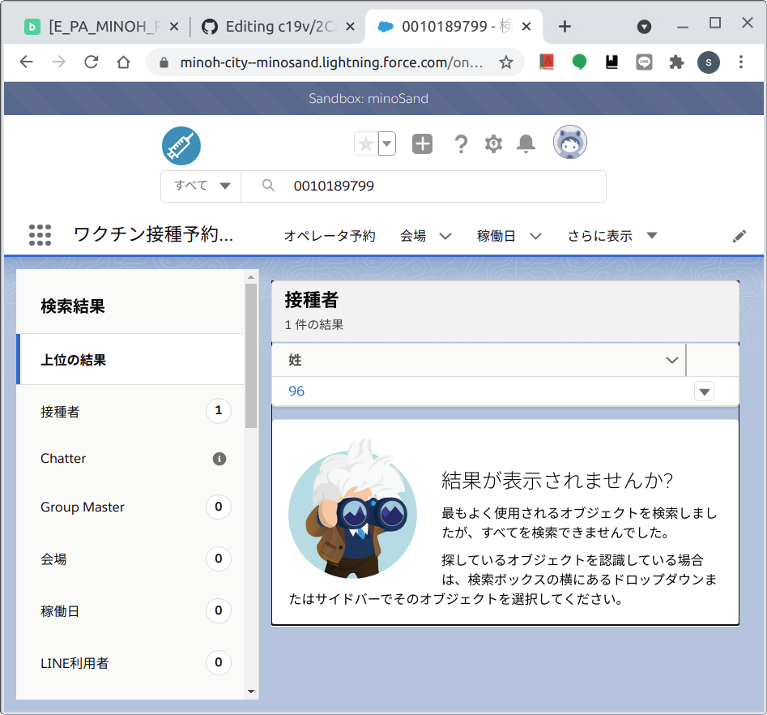  | 「○○コールセンター○○です。新型コロナワクチンの集団接種のご予約でよろしいでしょうか。予約の変更をご希望ですね、承知しました。恐れ入りますが、もし、ご希望の場所や日時にもう空きがないという場合、変更のご案内ができない場合もありますが、その場合はどうされますか？いまの予約にお越しいただけますか、それともご都合が悪くなられましたか？ 承知しました。それでは、いまお手元に接種券はお持ちでしょうか。接種券番号を教えてください。（欄外の検索窓に入力して対象者を検索し、「ワクチン予約」の「予約名」をクリックし、「会場名」と「予約日時」を確認する。）
 画面３ |   | （いまお取りいただいている予約は、どこの会場の何月何日の何時からのご予約か、おわかりになりますか？）
 画面４ | 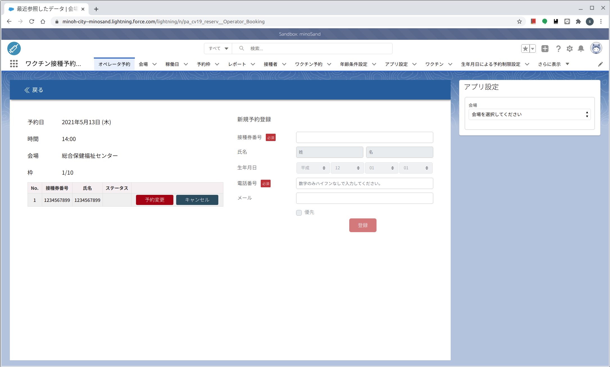  | いまのご予約が確認できました。
 画面５ | 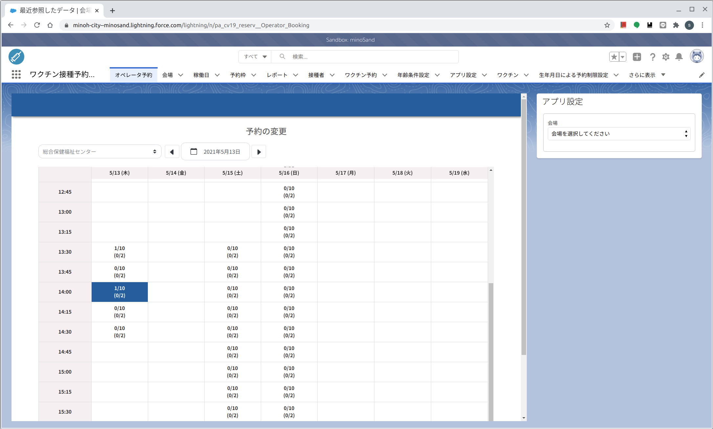  | それでは、改めて、会場やお日取りのご希望はございますか？空きがあるか見てみます。
 画面６ | 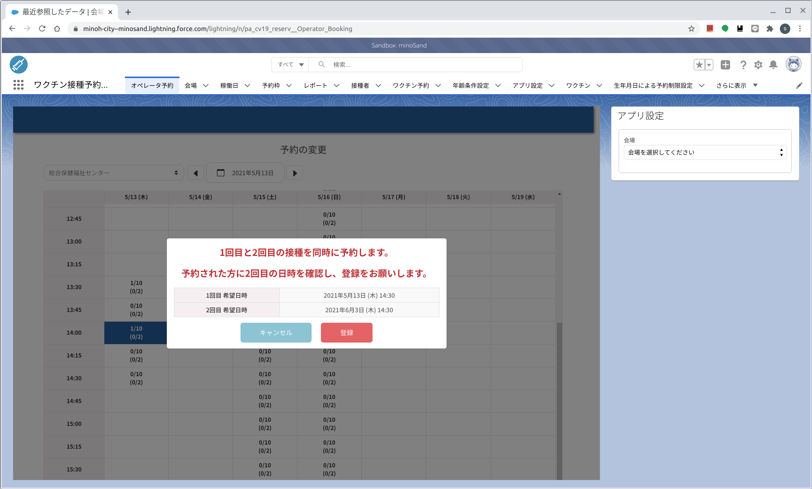  | それでは１回目接種を○月○日○時○分から、２回目接種をその３週間後の同じ曜日同じ時間の○月○日○時○分から、でご予約を変更しました。予約番号が変わりまして、○番ですので、お問い合わせいただきます時には、接種券番号と併せてこの予約番号もおっしゃってください。
 画面７ |   | 申し訳ありません、ご希望の日程はいっぱいで、お取りできませんでした。いまのご予約はどうさせていただいたらよろしいでしょうか。  

## 5-3.予約キャンセル時の話法  
 画面 | 画面イメージ | セリフ  
----|----|----
 画面１ |   | 事前にログインしておく 
 画面２ |   | 「○○コールセンター○○です。新型コロナワクチンの集団接種のご予約でよろしいでしょうか。予約のキャンセルをご希望ですね、承知しました。恐れ入りますが、いったんキャンセルされますと、すぐに次のかたをご案内しますので、キャンセルの取り消しというのはできませんが、よろしいでしょうか。 承知しました。それでは、いまお手元に接種券はお持ちでしょうか。接種券番号を教えてください。（欄外の検索窓に入力して対象者を検索し、「ワクチン予約」の「予約名」をクリックし、「会場名」と「予約日時」を確認する。）
 画面３ | 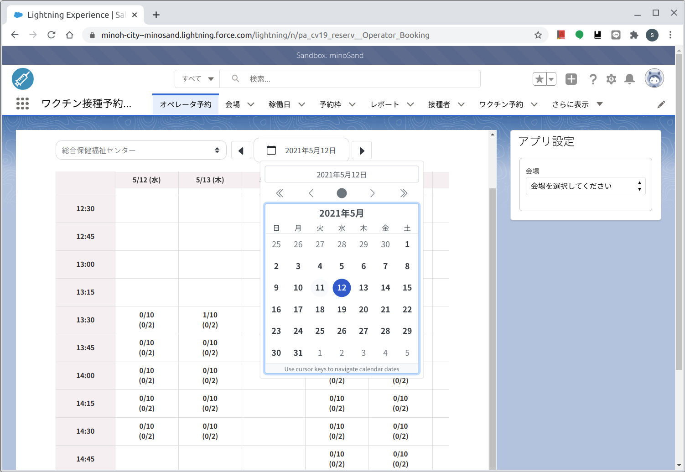  | （いまお取りいただいている予約は、どこの会場の何月何日の何時からのご予約か、おわかりになりますか？）
 画面４ | 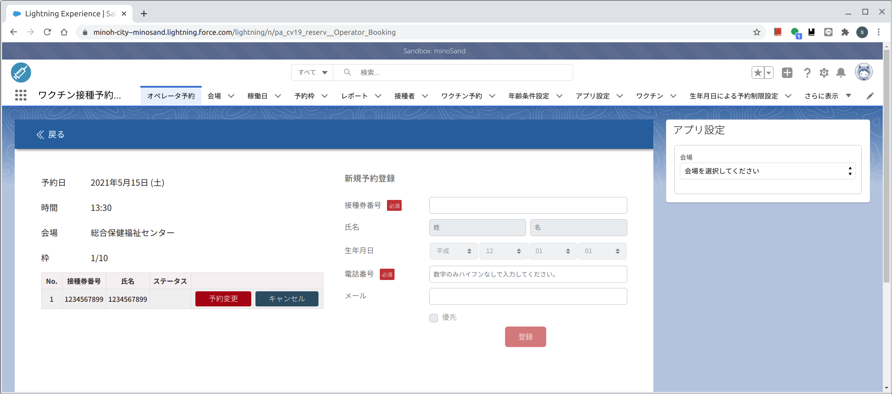  | いまのご予約が確認できました。  
 画面５ | 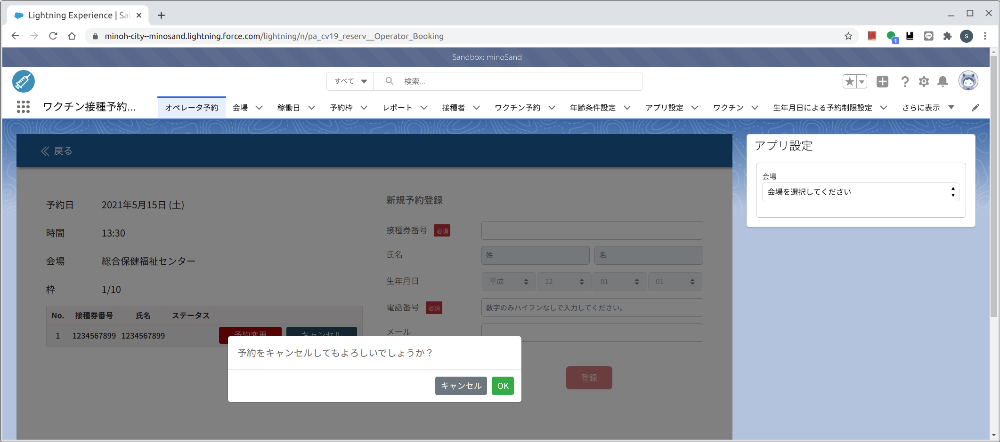  | キャンセルいたしました。
 画面６ | 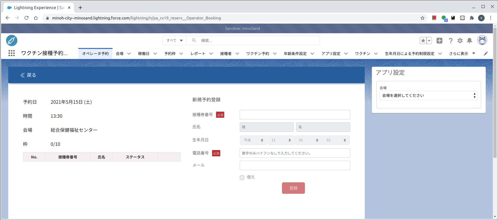  | そうしましたら、またご都合がよくなって接種を受けられようと思われましたら、あらためてご予約を取り直していただきますようにお願いいたします。わざわざご連絡いただきましてありがとうございました。コールセンター「○○」が承りました。失礼いたします。  
 