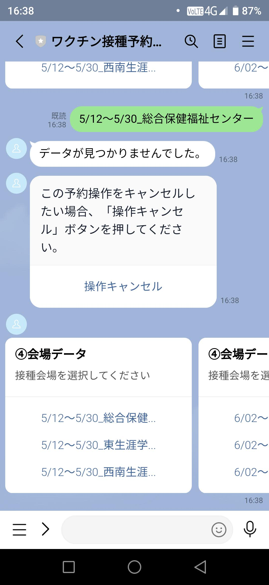
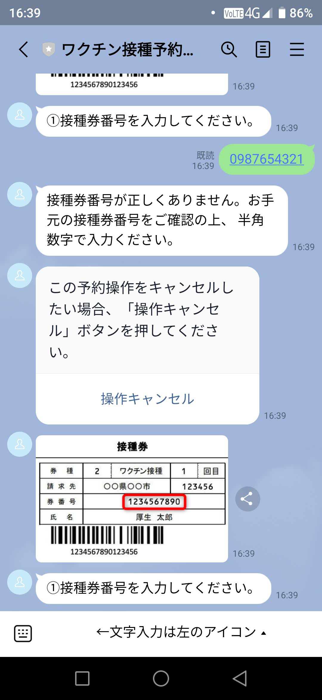
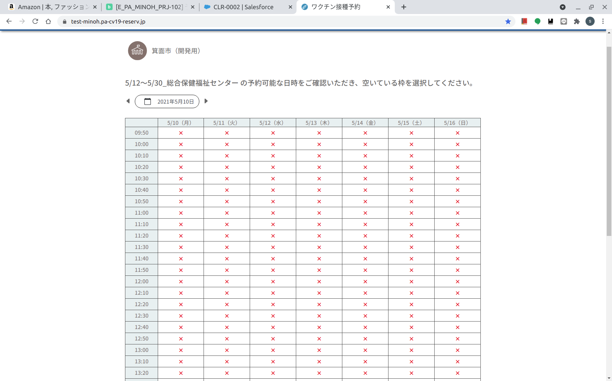
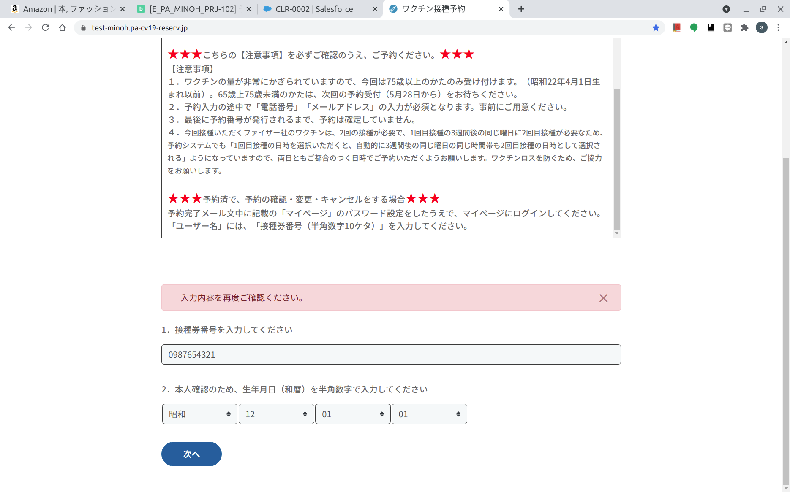
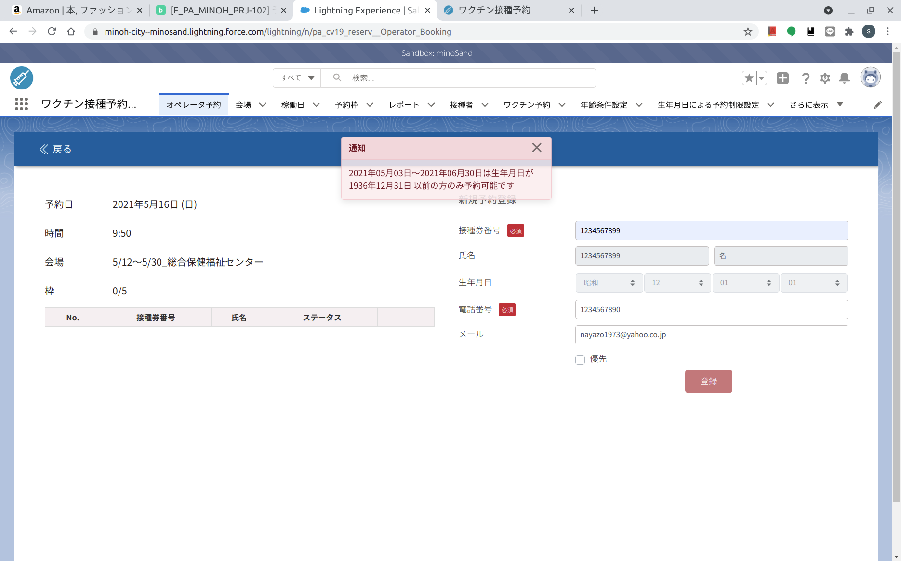
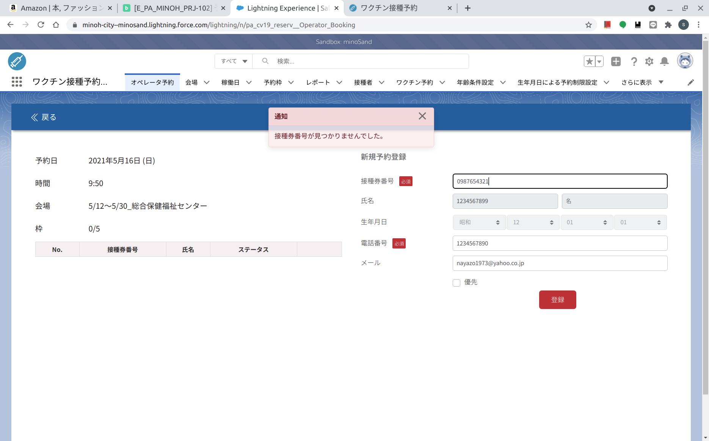

# 7.設定切替  
## [戻る](https://github.com/78tch/VaccineYoyaku)　[1.システム概要](https://github.com/78tch/VaccineYoyaku/blob/main/1About/1-1About.md)　→　[2.システムメッセージ文言](https://github.com/78tch/VaccineYoyaku/blob/main/2SystemMessage/2-0Messages.md)　→　[3.制限機能](https://github.com/78tch/VaccineYoyaku/blob/main/3Limit/3-1Limit.md)　→　[4. 動作確認](https://github.com/78tch/VaccineYoyaku/blob/main/4Check/4-1Check.md) 　→　[5. コールセンター話法](https://github.com/78tch/VaccineYoyaku/blob/main/5Callcenter/5-1Callcenter.md)　→[6. 予約枠](https://github.com/78tch/VaccineYoyaku/blob/main/6Timetable/6-1Timetable.md)　→　7. 設定切替  
## システム全体  
1. 「予約無効化」フラグを設定しておいて、５月６日９時に手動でオンにする  
　手動でオンにしても、１０秒〜２０秒ぐらいはラグがある模様。  
　念のためタイマーもかけておく？（殺到してレスポンスが悪くなった場合対策）
  
2. ７５歳未満の人が予約できないようにする制限（案は２つ）  
* 案１．システム設定の制限により、「1947年4月1日以前のみに制限」する
  * LINE版：会場選択まではできる。会場を選択すると「データが見つかりませんでした。」（予約できる枠がない場合の動作。）
  * Web版：会場選択まではできる。時刻表が延々と「×」のみで、「○」がいっさいない。（同上）
  * オペレータ版：「対象期間は生年月日が1947年4月1日以前の方のみ予約可能です」
* 案２．1947年4月2日以降の人を、対象者リストに載せないでおく
  * LINE版：「接種件番号が正しくありません。お手元の接種件番号をご確認の上、半角数字で入力ください。」
  * Web版：接種券番号を入れる画面で「入力内容を再度ご確認ください。」となり、先に進めない。
  * オペレータ版:「接種券番号がみつかりませんでした。」 

　→案２．は確実に誤受付を防げるが、文言の与える印象からすると、案１．のほうがよいと思われる。（最悪の場合、誤受付しても・・・）

No. | 生年月日制限の場合の画面 | リストにない場合の画面    
----|----|---  
 LINE |  |    
 Web |  |    
 CC |  |    

## LINE版の要切替設定
1. リッチメニューを出す・出さない設定  
　その際のメッセージ「新型コロナワクチン接種予約の受付開始に先立ち、リッチメニューを公開します。予約の前に必ず「トーク」を開いて、アカウントの事前登録をお願いします。」
2. 「接種予約」ボタンの無効化  
　　「接種予約」ボタンを押したときの動作を、受付開始前日までは「受付開始は５月６日からです、事前登録を」というメッセージにしている。  
　　開始のまえに、この設定を本来の「接種予約メニュー呼び出し」動作に切り替える必要がある。  
　　この切替はタイマー機能なし、手動が必要。  
　　どのタイミングで変更するか（前日深夜？）  
3. 

## Web版の要切替設定  
1. トップページの文言  
　　「まだ受け付けしていません」を、開始のすこし前に削除する必要あり。  
　　この切替はタイマー機能なし、手動が必要。  
　　どのタイミングで変更するか（前日深夜？）  
2. 
